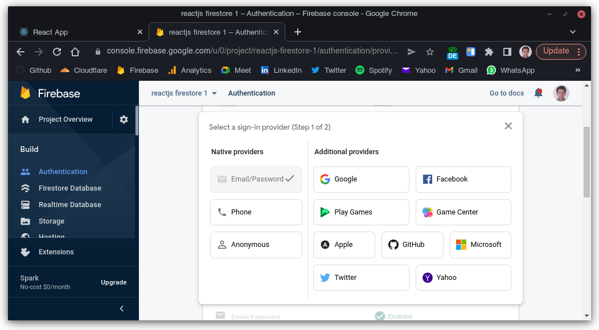
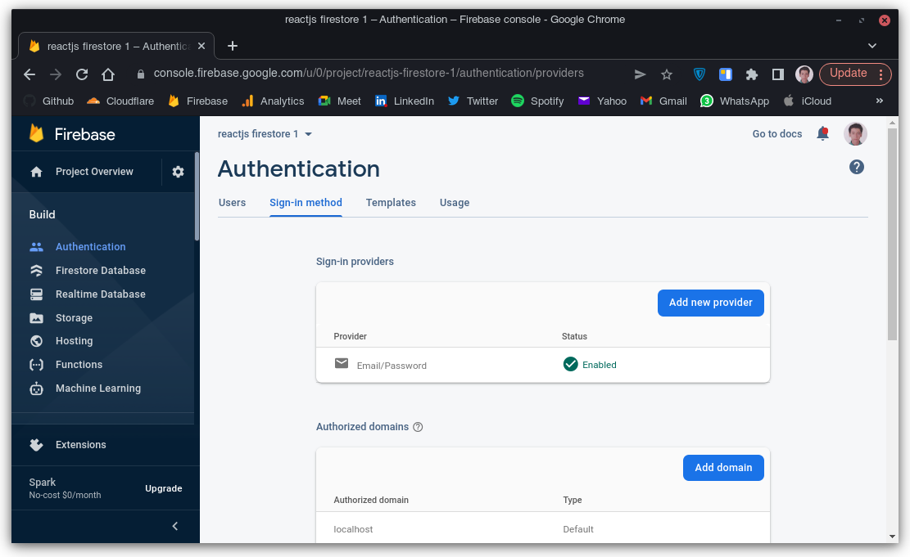
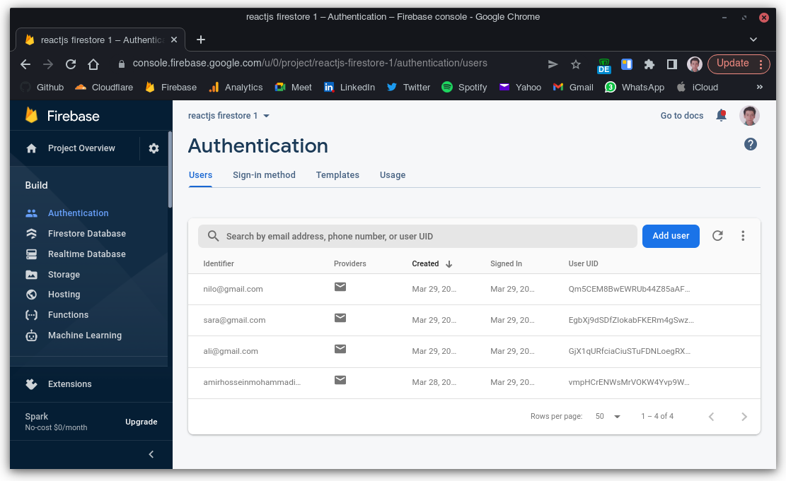
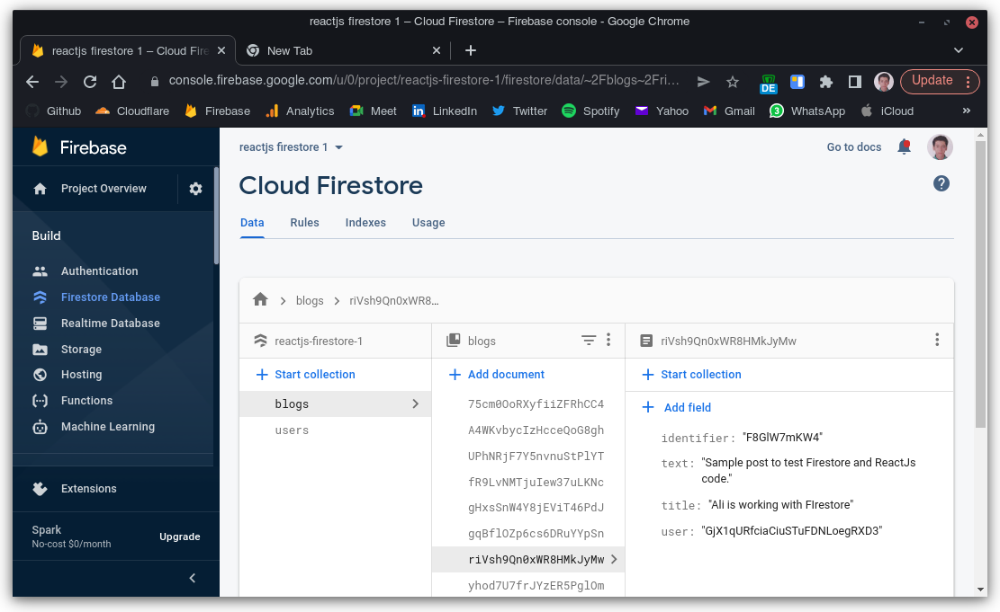
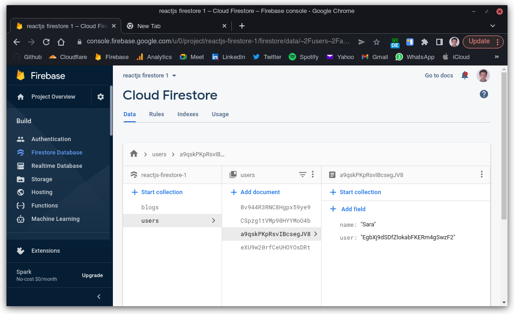

# React - Firestore

Firestore is one of the best database providers provided by Google Firebase.

So, we used Firestore with Flutter but not with Reactjs.

## Preview

First, let's see the app.


## Authentication

Main part of any application, is the security. Use didn't use any custom API or things like this. We used **Firebase Authentication service**.

### How is it working?

Well it has some providers as you can see.



We used **Email and Password** provider for this app. If you are curious about other providers. I have some projects thought **Firebase Authentication** in **ReactJs** and **Flutter**.



- [ReactJs | Google authentication, Anonymous authentication, Email - Password authentication](https://github.com/BlackIQ/react-firebase)
- [Flutter | Anonymous authentication, Email - Password authentication](https://github.com/BlackIQ/Firebase-Practical-1)
- [Flutter | Anonymous authentication, Email - Password authentication](https://github.com/BlackIQ/Firebase-Practical-2)
- [Flutter | Google authentication, Anonymous authentication, Email - Password authentication | Accessing user data](https://github.com/BlackIQ/Firebase-Practical-3)

### Users

All users store in Firebase.



We just store uid and Name if Firestore.

## Database

As we said before, we used **Firestore** as our database.

### Collections

There are just 2 collections.

- Blogs


- Users


## How to run

1. Clone it and go to the app dir

```shell
$ git clone https://github.com/BlackIQ/react-firestore-blog
$ cd react-firestore-blog
```

2. Then enter `npm` installing deps command 

```shell
$ npm i
```

3. Last, run it

```shell
$ npm start
```
